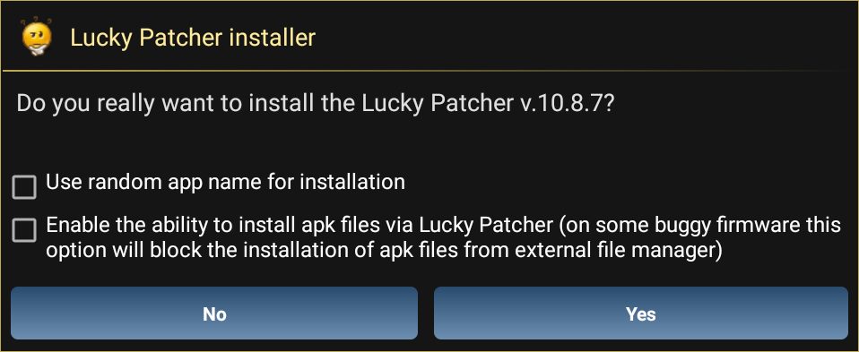
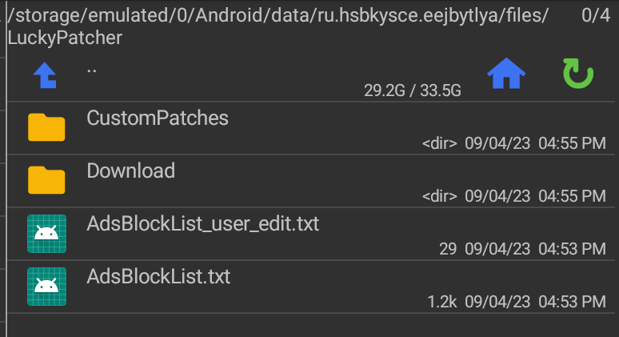

# Yu-Gi-Oh! Cross Duel MEmu/Root Android Installation Guide

This guide will describe the process of installing Yu-Gi-Oh! Cross Duel on MEmu or a rooted Android device by using the "willow-install" script.

Note that willow-install only supports Windows for now. Linux and macOS support will come at a later time.

## Overview / summary

The steps below may seem a bit daunting at first, but in reality it's just a very detailed description of what you actually have to do to get this running.

The general gist is the following:

- Plug in a rooted device with ADB enabled / run an emulator with root enabled

- Run  `willow-install` and follow its instructions (which involve installing Lucky Patcher and a license bypass patch for the game)

And that's basically all there is to running the modded build of the game. 

If you know what you're doing, this shouldn't be too hard to follow.

If you don't, then the rest of this guide is for you!

## Getting started

First, let's get the requirements out of the way. If you don't have MEmu set up, the process is described further below.

Requirements (for MEmu):

- a Android 9.0 (64bit) image

- Root mode ENABLED

Requirements (for Android hardware):

- an ARM64 compatible CPU

- Root (e.g. Magisk)

- ADB access enabled in settings

And 1.8 GB of free space to install the game.

Optionally, you may also install the latest build of Lucky Patcher.

## MEmu setup (from scratch)

1. Go to [MEmu Play download website](https://www.memuplay.com/download.html) and install the MEmu player

2. Open "Multi-MEmu" or "Multiple Instance Manager" or "MEmuConsole":
   
   
   
   

3. In there, click on "New": 
   
   

4. Select "Android 9.0 (64bit)"

5. Wait a bit for it to get created.

6. After it's done, click on the settings button: 
   
   

7. In the settings window, make sure "Root mode" is switched on like so:
   
   

8. Click OK

9. Start the MEmu instance by pressing Start:
   
   

10. Once it starts up, give it a few minutes for it to set itself up and do any updates to Play Store Libraries.

Your MEmu setup process should now be complete. Next, move on to the "Game Setup" section.

## Rooted Android hardware setup

ADB is only needed for the installation process. You can disable it after it's done.

1. Enable ADB (check [this website how to enable](https://developer.android.com/studio/debug/dev-options))

2. Plug in your device to the computer 
   
   - Keep only ONE Android device with ADB plugged in at a time!
   
   - If you have MEmu with Root or anything else with ADB enabled, make sure to turn it off before!

3. Install any ADB drivers necessary for your device.

4. Keep the device plugged in throughout the install process.

## Game Setup

## Part 1: APK installation

1. Download the latest build of the game from the Willow Grotto Discord server. 

2. Extract the `WillowInstall.7z` package with your archiver of choice (7-Zip, WinRAR, PeaZip, etc.) or Windows Explorer if you're in Windows 11.

3. Run MEmu that we set up earlier if not already running (or if you're on hardware - plug in your device with ADB enabled now if it isn't already!)

4. Run `willow-install.bat`
   
   - Instructions are provided from within the script itself, but for the sake of simplicity, follow this guide here instead

5. In the terminal window, press any key on the keyboard to start the install process.

6. Wait a short while as it installs. 
   
   - If it gets stuck at any point, restart the MEmu instance or your device and try running `willow-install` again.
   
   - You may ask in the Willow Grotto Discord server for more assistance here.

7. After it's done installing, you'll be presented with a guide how to install Lucky Patcher on your device in the terminal window. You may safely ignore that and continue with this guide here.

8. You should see the "CrossDuel" icon now in your launcher. Do NOT launch it yet!

9. Close the terminal window

10. Continue to Part 2.

## Part 2: Patching

This patching process is necessary if you want to run the game without a Google Play license or don't want to log in.

In case you have the license (game in your account), you can skip this entire section by logging into your Google account.

1. Download the latest build of Lucky Patcher APK from [the official website here](https://www.luckypatchers.com/lucky-patcher-all-versions/)
   
   - Your antivirus software might flag this APK. This is a false positive. The application itself is perfectly safe to use.
   
   - In case you don't have access to the website or are offline completely, an APK is provided in the `luckypatcher` folder

2. Install the APK
   
   - If on MEmu, simply drag and drop the APK into the MEmu's window
   
   - If on real Android hardware, use whichever method you feel most comfortable with. You can do it with adb, for example: `adb install LuckyPatchers.com_Official_Installer_10.8.7.apk` or you can copy it directly to your device and use a file manager to install

3. Run "LP Installer"
   
   

4. In the "Do you really want to install..." dialog box, uncheck "Use random app name for installation" like so:
   
   

5. Select "Yes"

6. When presented with "For your security, your device is not allowed to install..." dialog:
   
   
   
   - Select "Settings"
   
   
   
   - Enable "Allow apps from this source"
   
   
   
   
   
   - Go back by pressing the back arrow button: 
   
   

7. You should now see the screen from before but without the pop-up. Select "Install"
   
   

8. After it's finished, select "Open":
   
   

9. Select "Start uninstalling the installer" in Lucky Patcher:
   
   

10. Wait for a bit and you should eventually be presented with the "Update found" screen. Select "Update".
    
    
    
    - If you never see this screen, go to the "Lucky Patcher Troubleshooting" section below

11. If you're presented with the "Google Play Protect" dialog:
    
    - Go through the process if and only if you're logged into a Google account
    
    - Otherwise select "No" and move on to the next step
    
    

12. You should now be presented with a list of apps like so:
    
    

13. Select CrossDuel:
    
    
    
    - It has to look exactly like this screenshot with the "Custom patch available" text and yellow title
    
    - In case it is NOT yellow, follow the steps described in the "Lucky Patcher Troubleshooting" section below, then go back here and continue

14. Select "Menu of Patches"
    
    

15. Select "Custom patch"
    
    

16. Select "Apply"
    
    

17. Select "Ok"
    
    

This should now conclude the patching process. You may uninstall Lucky Patcher now as well.

### Part 3: Launch the game

After the game has been installed and patched, you can now launch the game as per usual.

### Lucky Patcher Troubleshooting

In case you're having trouble with Lucky Patcher or are offline, follow the steps here

1. Install a file manager app (in this example we'll use Total Commander)

2. Go to your internal storage and copy `jp.konami.crossduel.txt`
   
   

3. Find the Lucky Patcher folder in the `Android/data` folder. It'll usually be some obfuscated name like `ru.hsbkysce.eejbytlya`
   
   

4. Enter inside. You should find `cache` and `files`. Open the `files` directory.
   
   

5. Enter `LuckyPatcher`
   
   

6. Enter `CustomPatches`
   
   

7. Paste `jp.konami.crossduel.txt` from earlier into this directory

8. Restart Lucky Patcher completely.
   
   - On MEmu, press the "X" on its tab
     
     
   
   - On other devices, go to the app switcher and swipe the app away
     
     
   
   - Launch Lucky Patcher again

CrossDuel should now have a yellow-colored title and should now say that it has "Custom patch available". You may now continue with the instructions from before.
